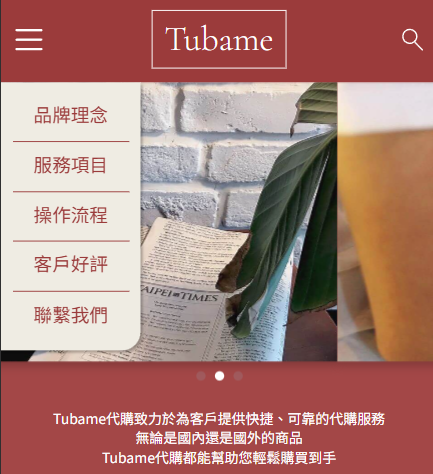
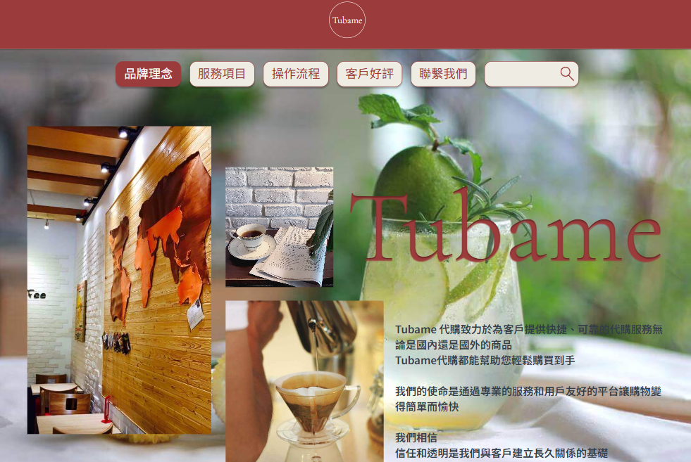
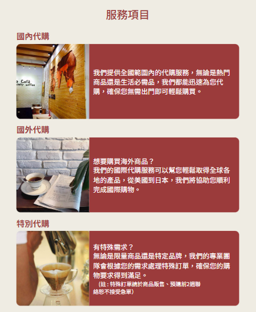
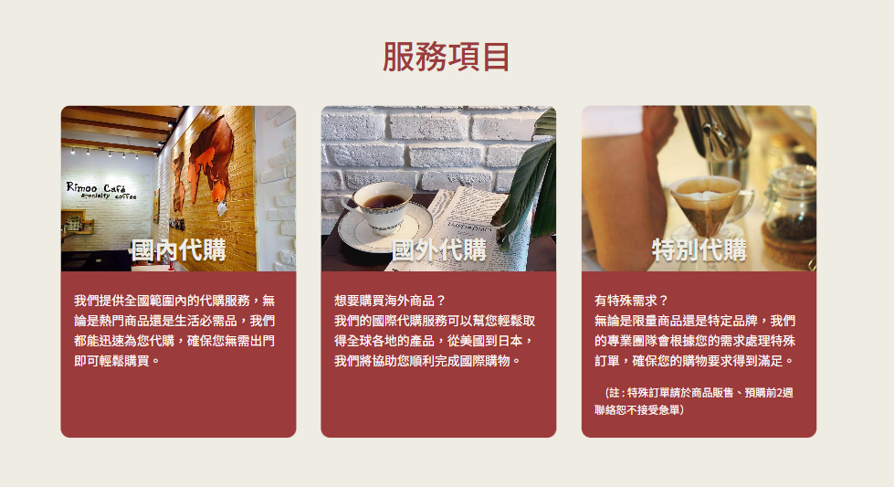
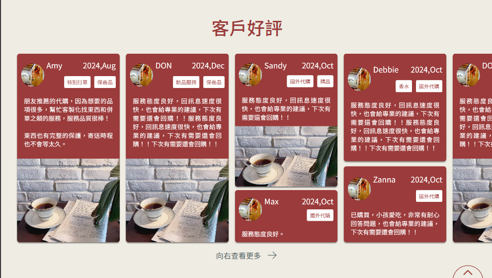

# 一頁式店家官網

這是一個不限制前端框架的案子 (我用的是React)，要求使用 Css（需遵循 BEM 命名規範），並有 4 個 breakpoint (w375, w640, w1440, w1920) 的 RWD。  
切版本身不難，但因為上半年基本上都用 Tailwind Css 寫 style 了，所以問題比較多的是在命名跟可讀性上。  
  
下面是幾個除了切版外，還有點不一樣的東西在的 sections  
圖片案主沒給所以都先隨便放😪  
  
# 行動裝置的 Carousal 是用 swiper.js 做der  ( w375, w1440 )  
  
  

# 根據不同裝置改變樣式，然後解鎖套件 react-responsive 的 useMediaQuery  ( w375, w1440 )  
  
  
  
# 瀑布流，按下hint用Framer motion製作移動  ( w375, w1440 )  
  
 
